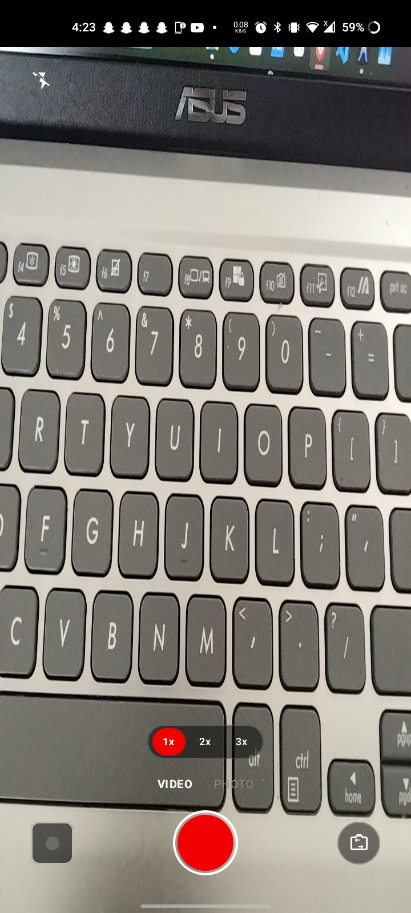
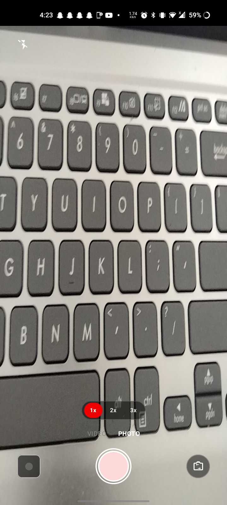
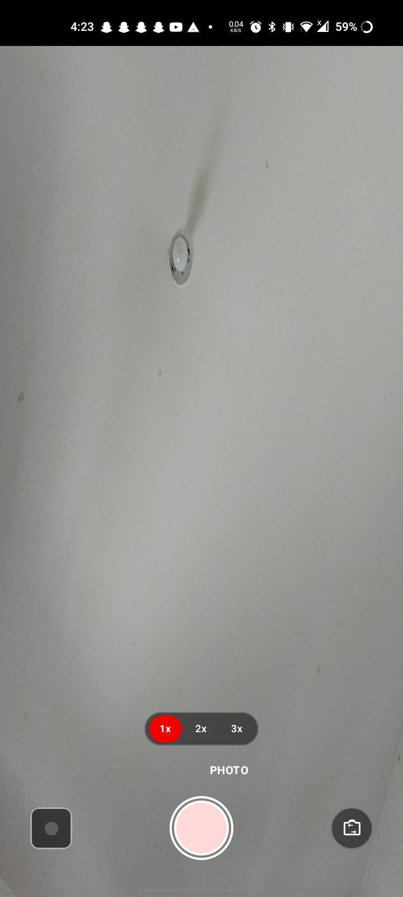
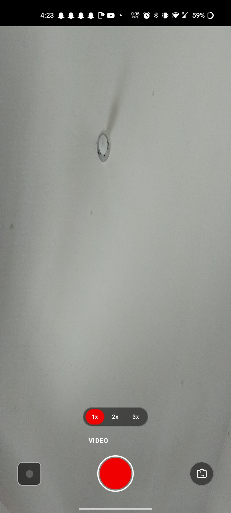

# Kamera

  
  
  
  

**Kamera** is an open-source Android camera and video recording application created to make high-quality video and photo capture simple, fast, and automatic.

Developed by **Luberisse Karl**.

---

## Features (v7.0)

- **Dynamic Hardware Sensor Orientation**: Real-time native sensor inclination detection (`CameraCharacteristics.SENSOR_ORIENTATION` & display rotation) keeping photos and videos strictly formatted in 9:16 portrait.
- **Quick App Launcher Shortcuts**: Long-press app icon shortcuts to jump directly into **Take a Photo** or **Record Video** modes.
- **Fixed 30 FPS Sensor Lock**: Fixed AE target FPS range `[30, 30]` preventing framerate drops in low-light indoor environments.
- **22 Mbps High-Bitrate Video**: Video encoding bitrate locked at 22 Mbps for crystal clear recording.
- **Strict MediaRecorder Execution Order**: Hardware unlocking and profile configuration sequence matching native camera pipelines.
- **Discrete High-Contrast Mode Switcher**: Dark capsule container ensuring high readability in any lighting condition.
- **Instant Fast Startup**: Direct camera preview launch with background thread initialization.
- **Pro Audio**: 2-channel stereo audio recording at 48.0 kHz.
- **Drag-to-Zoom Gesture**: Drag up/down on the shutter button for smooth digital zoom (1.0x to 3.0x).
- **Minimalist Zoom Pill**: Quick tap preset options (`1.0x`, `2.0x`, `3.0x`).
- **Full Screen Edge-to-Edge**: Translucent status bar and navigation layout.
- **Gallery Integration**: Instant opening of recorded videos and photos in system player/gallery.

---

## Screenshots

  
  
  
  

---

## Contributing

Contributions are welcome, but please adhere strictly to the project's core philosophy:

- **Keep it Minimalist**: The primary goal of Kamera is an ultra-clean, fluid, fast, and distraction-free UI/UX.
- **Strict UI/UX Standards**: Any pull requests or features that add visual clutter, unnecessary complexity, or break the minimalist aesthetic will **not** be accepted.
- **Custom / Heavy Features**: If you wish to build custom features, heavy settings, or complex functionalities that deviate from this minimalist vision, please **fork the repository** and maintain them in your personal fork.

---

## License

This project is open-source software licensed under the **GNU General Public License v3.0 (GPL-3.0)**.

### License Terms Summary:
- **Freedom to Use & Modify**: You are free to use, modify, and distribute the source code.
- **Attribution Required**: Any derivative work must credit the original author (**Luberisse Karl**) and state the source of the project.
- **Copyleft (GPLv3)**: If you modify or build upon this software, your contributions must also be released under the same GPLv3 open-source license.

For the full license details, see the [LICENSE](LICENSE) file or visit [gnu.org/licenses/gpl-3.0.html](https://www.gnu.org/licenses/gpl-3.0.html).

---

## Author

**Luberisse Karl**

